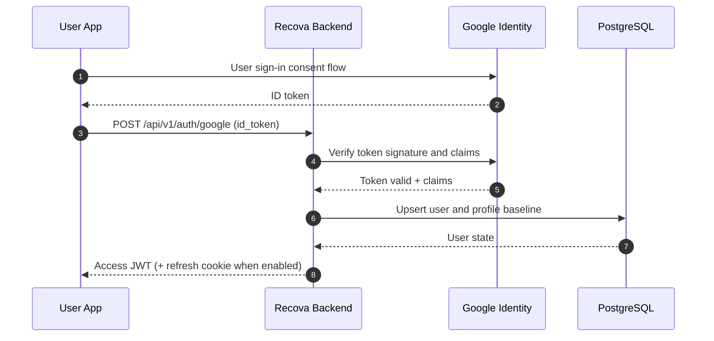

# Auth Module

Modul ini mengelola identitas pengguna, validasi kredensial federated login, pembentukan sesi, dan penghentian sesi.

## Responsibility

Modul auth memiliki tanggung jawab:

- login/registrasi via Google identity token,
- validasi identity token dari Google,
- issuance access token,
- issuance dan rotasi refresh token bila mode refresh-cookie diaktifkan,
- logout dan revocation sesi,
- auth middleware untuk endpoint terproteksi.

Modul auth tidak memiliki tanggung jawab:

- manajemen konten domain (routine, journals, community),
- kalkulasi statistik pengguna,
- kebijakan retensi data lintas modul.

## Route Prefix

```text
/api/v1/auth
```

## Endpoint Summary

| Method | Path                      | Auth   | Purpose                                                           |
| ------ | ------------------------- | ------ | ----------------------------------------------------------------- |
| `POST` | `/api/v1/auth/google`     | Public | Login/registrasi melalui Google identity token                    |
| `POST` | `/api/v1/auth/onboarding` | Bearer | Menyelesaikan data onboarding awal pengguna terautentikasi        |
| `POST` | `/api/v1/auth/refresh`    | Cookie | Mengeluarkan access token baru dari refresh token (jika aktif)    |
| `POST` | `/api/v1/auth/logout`     | Bearer | Mengakhiri sesi aktif dan revoke refresh token terkait (jika ada) |

Catatan kompatibilitas:

- Endpoint `refresh` dan `logout` wajib tersedia jika refresh-cookie strategy digunakan.
- Jika refresh-cookie belum diaktifkan pada rilis awal, endpoint tetap dipertahankan sebagai contract-ready dan mengembalikan error terstandar saat mode dinonaktifkan.

## Authentication Flow



## Google Token Verification Rules

Backend wajib memverifikasi identity token dengan aturan berikut:

- signature valid,
- `aud` sesuai client id backend,
- `iss` adalah issuer Google yang valid,
- `exp` belum kedaluwarsa,
- `sub` dipakai sebagai identifier principal eksternal stabil.

Token yang gagal verifikasi harus ditolak dengan `401 UNAUTHENTICATED` tanpa detail sensitif.

## Access Token Contract

Arah kontrak access token:

- format JWT ditandatangani server,
- masa berlaku pendek,
- claims minimal: `sub`, `iat`, `exp`, `iss`, `aud`,
- algoritma signing harus di-whitelist eksplisit.

Aturan validasi inbound JWT:

- verifikasi algoritma sebelum key usage,
- verifikasi signature,
- verifikasi `iss`, `aud`, `exp`, dan `sub`.

## Refresh Token and Cookie Rules

Jika mode refresh-cookie diaktifkan:

- refresh token bersifat opaque/random,
- token mentah hanya disimpan di cookie `HttpOnly`,
- server hanya menyimpan hash refresh token,
- setiap refresh sukses wajib merotasi refresh token,
- logout wajib menginvalidasi refresh token aktif.

Cookie minimum:

- `HttpOnly`,
- `Secure` di production,
- `SameSite` eksplisit,
- scope domain/path eksplisit,
- TTL sesuai kebijakan sesi.

## Middleware Contract

Auth middleware wajib:

- mengekstrak bearer token dari header `Authorization`,
- memverifikasi token sesuai aturan validasi,
- menaruh identity context aman ke request context,
- menolak request invalid dengan envelope error standar.

Context aman minimum:

- `user_id`,
- `session_id` atau `token_id` bila ada,
- `request_id` dari middleware request-id.

## Revocation and Logout

- logout endpoint harus idempotent,
- refresh token yang sudah direvoke tidak boleh diterima ulang,
- revoke event harus tercatat pada audit log,
- akses token lama ditangani melalui TTL pendek dan denylist opsional bila diperlukan.

## CORS and CSRF Considerations

Aturan wajib jika refresh menggunakan cookie lintas-origin:

- `AllowCredentials=true` hanya untuk daftar origin eksplisit,
- wildcard origin dilarang saat credentials aktif,
- unsafe HTTP methods wajib dilindungi CSRF token untuk endpoint berbasis cookie,
- trusted origin list harus eksplisit.

## Development-Only Behavior

Jika ada endpoint reset data pengguna untuk pengujian:

- hanya aktif pada environment development,
- tidak boleh aktif di staging/production,
- wajib dilindungi guard environment fail-fast.

## Open Gaps

Area yang perlu finalisasi lanjutan sebelum implementasi penuh:

- keputusan nilai TTL access/refresh token final,
- strategi denylist access token saat incident response,
- kebijakan multi-device session limits.

## Related Documents

- [Authentication and Trust Boundaries](/Users/macbookpro/Development/recova-backend-v2/docs/overview/authentication-and-trust-boundaries.md)
- [Users Module](/Users/macbookpro/Development/recova-backend-v2/docs/modules/users.md)
- [Onboarding Module](/Users/macbookpro/Development/recova-backend-v2/docs/modules/onboarding.md)
- [API Response Standard](/Users/macbookpro/Development/recova-backend-v2/docs/api-response-standard.md)
- [ADR 0007 Auth Token Strategy](/Users/macbookpro/Development/recova-backend-v2/docs/decisions/adr-0007-auth-token-strategy.md)

## Source Reference

- [references/README.md](/Users/macbookpro/Development/recova-backend-v2/references/README.md)
- [Google OAuth2 Web Server Applications](https://developers.google.com/identity/protocols/oauth2/web-server)
- [Google Backend Auth Verification](https://developers.google.com/identity/sign-in/web/backend-auth)
- [JWT Best Current Practices (RFC 8725)](https://www.rfc-editor.org/rfc/rfc8725)
- [Fiber JWT Middleware](https://docs.gofiber.io/contrib/v3_jwt_v1.x.x/jwt/)
- [Fiber CORS Middleware](https://docs.gofiber.io/middleware/cors/)
- [Fiber CSRF Middleware](https://docs.gofiber.io/middleware/csrf/)
